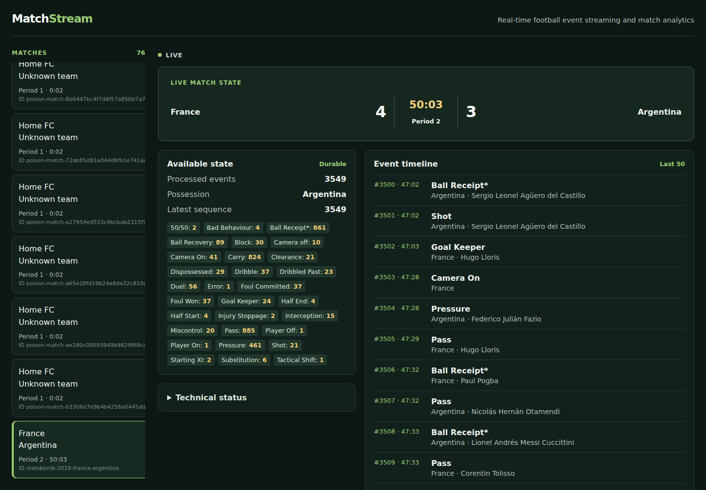

# MatchStream

MatchStream replays historical StatsBomb football matches as a live,
event-driven system. It turns a canonical event stream into durable match state,
serves that state through FastAPI and WebSockets, and presents it in a React
dashboard.

## Demo

The portfolio demo is the 2018 FIFA World Cup round-of-16 match **France 4–3
Argentina** (StatsBomb Open Data match `7580`). Its 3,549 events were replayed
through the complete local stack and the final durable score matched the source
record. The data file is downloaded on demand and is not committed.



```bash
make real-demo-download
```

The screenshot is a real local headless-browser capture using the durable
StatsBomb replay above. A second capture of the technical panel is available at
[docs/assets/france-argentina-technical.png](docs/assets/france-argentina-technical.png).
See [the demo instructions](docs/milestone-9.md).

## What it does

- Converts StatsBomb Open Data JSON into a small, provider-independent canonical
  event model, then replays it deterministically.
- Publishes versioned events to Kafka-compatible Redpanda, preserving match
  order with `match_id` partition keys.
- Projects events atomically into PostgreSQL with durable event identity,
  bounded retries, poison-event DLQ quarantine, and deterministic rebuild.
- Exposes durable snapshots/history and best-effort live state through FastAPI,
  WebSockets, and a React/TypeScript dashboard.

## Architecture

```text
StatsBomb Open Data
        ↓ canonical conversion + deterministic replay
Redpanda / Kafka ── retry → DLQ (persistent projection poison only)
        ↓ match_id partition key
Reliable durable processor
        ↓ PostgreSQL transaction: identity + history + MatchState
PostgreSQL ── LISTEN/NOTIFY → FastAPI
        ↓ HTTP snapshot/history + best-effort WebSocket update
React dashboard
```

The detailed rationale, transaction boundary, consistency model, and scaling
trade-offs are in [system design](docs/system-design.md) and
[architecture](docs/architecture.md).

## Engineering highlights

- Versioned broker contracts separate provider ingestion from transport.
- `match_id` keys keep one match ordered within a Kafka partition.
- PostgreSQL persists processed event identity, canonical history, and state in
  one transaction before the source offset can be committed.
- Redelivery after a crash is safe: a committed event ID becomes a durable
  no-op rather than applying state twice.
- Deterministic transition rules make offline state rebuilds reproducible.
- Retry/DLQ handling lets a known poison event stop blocking later records.
- Prometheus metrics, structured logs, health checks, lag inspection, and
  sequence-aware HTTP/WebSocket reconciliation make runtime behavior visible.

## Measured local performance

On WSL2 (Intel i7-1355U, 15 GiB RAM), Python 3.13.11, Node 20.18.2,
PostgreSQL 17.11, and Redpanda 26.2.1:

| Workload | Observed result |
| --- | --- |
| Durable stream processing | 37.9–44.9 events/s across three 80-event trials |
| PostgreSQL transaction mean | 18.4–22.4 ms/event |
| HTTP snapshot, concurrency 1 | p50 11.4 ms, p95 13.3 ms (40 requests) |
| HTTP event history, concurrency 8 | p50 200.9 ms, p95 208.2 ms (40 requests) |
| WebSocket durable-commit to receipt | p50 24.1–29.1 ms for 1, 4, and 8 clients |
| Lag recovery | 80-event burst drained to zero in 1.711 s (46.7 events/s) |

These are local-development measurements, not production capacity claims.
Raw trial data and methodology are in [the benchmark report](reports/benchmarks/milestone-9-summary.md).

## Reliability exercised

Observed local tests cover PostgreSQL and Redpanda outages, consumer restart,
poison-event DLQ flow, API restart, and WebSocket reconnect snapshots. The
system promises durable projection/idempotency at the PostgreSQL boundary—not
exactly-once delivery or durable WebSocket messages. Details are in
[the reliability report](reports/reliability/milestone-9.md).

## Quickstart

```bash
python -m venv .venv
.venv/bin/pip install -e ".[dev]"
docker compose up -d
make db-init
```

Use separate terminals:

```bash
# durable processor
python -m matchstream.streaming.cli resilient-project \
  --topic matchstream.demo --dlq-topic matchstream.demo.dlq --group-id matchstream-demo

# API
make api

# dashboard
make frontend-install && make frontend-dev

# replay the real demo after make real-demo-download
python -m matchstream.streaming.cli produce --topic matchstream.demo \
  --match-id statsbomb-2018-france-argentina --speed 120 \
  data/raw/statsbomb-2018-france-argentina-7580.json
```

The default dashboard is `http://127.0.0.1:5173`; configured CORS origins are
explicit. The browser never reads PostgreSQL directly.

## Verification

```bash
make release-check
make integration
```

`matchstream --version` and `matchstream project-info` expose release metadata
after installation. See [CONTRIBUTING.md](CONTRIBUTING.md) for the supported
development flow.

## Limitations

This is a local, single-node development system: no HA/failover, auth,
horizontal API fan-out coordination, distributed transaction, or advanced
football analytics. WebSocket delivery is best effort; HTTP snapshots/history
are the recovery and truth path. See [limitations](docs/limitations.md) for
the complete, precise list.
